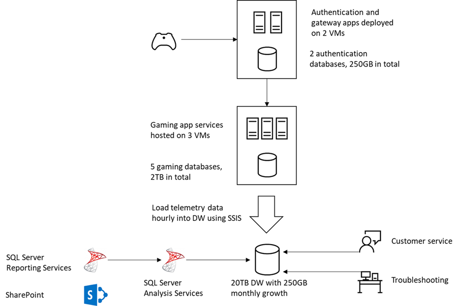

# Migrating to Azure SQL Database Managed Instance

Tailspin Toys is the developer of a popular online video game series, which has grown rapidly over the last several years. They began operations is 2010, and have grown steadily since releasing the first installment of their popular game series.

They began as a game development company, made up primarily as developers. As their flagship game grew in popularity, they added an online-play component, and began hosting the gaming services on-premises.

Their on-premises gaming services consist of three virtual machines hosting the gaming software and five SQL Server 2008 R2 databases hosted on a single database instance. Tailspin Toys is using the Service Broker feature of SQL Server within their databases. Service Broker is a feature of SQL Server used for sending and receiving guaranteed, asynchronous messages by using extensions to the Transact-SQL Data Manipulation Language (DML). This functionality is being used for several critical gaming processes, and they cannot afford to lose this capability when migrating their operations database to the cloud. They have also stated that, at this time, they do not have the resources to rearchitect the game to use an alternative message broker.

In addition, Tailspin Toys is using several other features of SQL Server, including using SSIS to perform ETL and load data into their data warehouse using SQL Server. They build SSAS cubes and create reports using SSRS. The reports are deployed to SharePoint sites. Their customer service personnel and their developers also connect to the data warehouse for various activities.

As the popularity of their game has grown they have run into several issues around scalability and latency, in addition to long outages when deploying updates or bug fixes. Compounding this issue is the fact that the majority of their engineering resources are developers, and they do not have a true, dedicated SQL DBA to manage their database resources. That they believe migrating their services to the cloud might be able to help alleviate some of these issues.

They are aware the SQL Server 2008 R2 is nearing end of support, and are looking for a solution that will get them onto a more current version of the database, preferably one that allows them to take advantage of some of the more advanced security and performance tuning features.

They are looking for a proof-of-concept (PoC) of a solution that enables them to migrate their on-premises gaming software and SQL Server 2008 R2 databases into cloud services in Azure.

In addition, they have read about some of the advanced security and performance tuning options that are available only in Azure and are interested in understanding how they can leverage these features in their gaming platform. Due to their rapid growth, and limited database resources as they grew, they have a heavy reporting workload on their online transaction processing database. They are very interested in learning if there are any options to move this reporting workload off their primary server, but don't have the time or resources to make any architectural changes to the database or application at this time.

## Current architecture

Tailspin Toys' current architecture consists of the following resources:

- Authentication and gateway: 2 VMs, 2 SQL Server databases in one instance, total size is 250GB
- Gaming: 3 VMs, 5 SQL Server databases in one instance total size is 2TB
- DW: 1 SQL Server database, total size is 20TB with 250GB monthly growth
- ETL: SQL Server Integration Services, loading data to DW hourly
- Data analytics: SQL Server Analysis Services
- Reporting: SQL Server Reporting Services, reports deployed to SharePoint sites

## Target audience

- Database administrators
- Application developers
- SQL/Database developers

## Abstract

### Workshop

In this workshop, you will learn to develop a plan for migrating on-premises web applications and SQL Server 2008 R2 databases into PaaS services in Azure. You will perform assessments to reveal any feature parity and compatibility issues between the customer's SQL Server 2008 R2 database and the managed database offerings in Azure. You will then provide a solution to migration their web applications and databases into Azure services, with zero down-time. You will then enable some of the advanced SQL features available in Azure to improve security and performance in the customer's application.

At the end of this workshop, you will be better able to design and implement a cloud migration solution for applications and database that cannot experience downtime, and with features that are incompatible with Azure SQL Database.

#### Outline: Key concerns for customer situation

- They have struggled to host more gamers as their game's popularity has grown.
- With their databases hosted on-premises, gamers in other regions complain about high latency when playing online. What options are available to help resolve this issue. Players of their game are world wide.
- The majority of their engineers are game developers, and the don't really have a dedicated SQL DBA.
- They are currently renting the hardware used for game hosting services. Their current contract ends in 3 months, and they would like to be migrated into the cloud so they don't have to sign another contract on the rental equipment.
- They cannot afford to experience down time during their cloud migration. Is it possible for their application and database remain online during a migration to the cloud?
- With a migration to the cloud, they are looking for a solution that offers build-in high availability and high performance.
  - Build this out as basis for decision between General and Business Critical service tiers.
- They are using Service broker in the SQL Server 2012 database, and have heard that feature is not supported in Azure SQL Database.
  - Are there any options outside of migrating to a VM for hosting the database in Azure?
  - Are there any tools that can help them better understand any feature parity and compatibility issues they might not be aware that could prevent them from migrating to a managed database service in Azure?
- In their current system, they run a lot of reports directly from the application database. Is there any way that can alleviate the performance impacts on the system, without having to completely re-architect the application and database?
- They do not have a dedicated DBA, so they know there are security features available that they have not had a chance to turn on. They are interested in learning more about any advanced SQL features that could help improve their security posture.
- They have a global customer base, and must meet GDPR requirements. They are interested in learning about any tools that might help them to better understand their database, and the data it contains, and any compliance-related policies that may apply to the data.

### Whiteboard design session

In this whiteboard design session, you will work in a group to develop a plan for migrating on-premises web applications and SQL Server 2008 R2 databases into PaaS services in Azure. You will provide guidance on performing assessments to reveal any feature parity and compatibility issues between the customer's SQL Server 2008 R2 databases and the managed database offerings in Azure. You will then provide a solution to migration their web applications and databases into Azure services, with zero down-time. You will also provide guidance on how to enable some of the advanced SQL features available in Azure to improve security and performance in the customer's application.

At the end of this workshop, you will be better able to design a cloud migration solution for applications and database that cannot experience downtime, and with features that are incompatible with Azure SQL Database.

#### Key points

- Decide between service tiers in SQL MI.
- Use Assessment tools to determine best target version of SQL for their workloads
  - Discussion about Database Experimentation Assistant (DEA).
  - Discussion about Azure Database Migration Service (DMS) and Azure Data Migration Assistant (DMA).
  - End of support scenario for SQL Server 2008 R2.
  - Public endpoints (available end of April)
    - Allows easier access to SQL MI databases.
  - Read Scale-out with online secondary read-only replica
  - In memory OLTP?

### Hands-on lab

In this hands-on lab, you will implement a proof-of-concept (PoC) for migrating on-premises web applications and SQL Server 2008 R2 databases into PaaS services in Azure. You will perform assessments to reveal any feature parity and compatibility issues between the customer's SQL Server 2008 R2 databases and the managed database offerings in Azure. You will then migrate their web applications and databases into Azure services, with zero down-time. Once the application and database are migrated, you will enable some of the advanced SQL features available in Azure to improve security and performance in the customer's application.

At the end of this workshop, you will be better able to implement a cloud migration solution for applications and database that cannot experience downtime, and with features that are incompatible with Azure SQL Database.

#### Outline: Hands-on lab exercises

- Before the hands-on lab
  - Task 1: Provision SQL MI
  - Task 2: Provision Lab VM in same VNet as SQL MI
  - Task 3: Configure Lab VM
    - Install SSMS
    - Download and install Data Migration Assistant (DMA)
  - Task 4: Provision SQL Server 2008 R2 on Windows Server 2008 VM
    - Open firewall for port 1433 on server and in the Azure portal
    - Restore database onto server
    - Enable Service Broker on the database
    - Reset `sa` password
  - Task 5: Create App Service (Web App) in Azure portal
    - Configure network connection to SQL MI VNet Gateway subnet
  - Task 6: Provision Azure Database Migration Assistant in the Azure portal
- Exercise 1: Deploy web app
  - Task 1: Deploy web app to App Service
  - Task 2: Configure connection string to point to SQL 2012 database
- Exercise 2: Perform assessments on SQL 2012 database
  - Task 1: Perform assessment using DMA against Azure SQL Database
  - Task 2: Perform assessment using DMA against Azure SQL Database Managed Instance
- Exercise 3: Migrate the database to SQL MI using DMS
  - Task 1: Set up DMS project for online migration
  - Task 2: Enable transactional replication to allow online migration
- Exercise 4: Update application to point to SQL MI database
  - Task 1: Update the application settings connection string
  - Task 2: Connect your app to SQL MI.
    - Create a gateway subnet in your SQL MI VNet.
    - Create a VPN gateway.
    - Set the point to site addresses.
    - Configure VNet integration with the App Service.
  - Task 3: Launch the app
- Exercise 5: Enable Advanced Data Security.
  - Review Vulnerability Assessment.
  - Enable Transparent Data Encryption.
- Exercise 6: Enable SQL Data Discovery and Classification feature in SSMS
- Exercise 7: Enable Dynamic Data Masking
  - Task 1: Review database tables, and sensitive values being displayed in clear text.
  - Task 2: Apply masks to fields in tables (Credit card numbers, email address, etc.) Demonstrate various functions for adding masks using DDM.
- Exercise 8: Use online secondary for read-only queries.
  - Task 1: Create read-only connection string in web application code
  - Task 2: Add read-only connection string to Web App application settings, using `ApplicationIntent=ReadOnly` settings in connection string.
  - Task 3: Simulate heavy transactional load on the primary SQL MI database
  - Task 4: Demonstrate how read-only replica can be accessed for reporting with minimal impact on the primary instance

## Azure services and related products

- Azure SQL Database Managed Instance
- Azure SQL Database
- Azure Database Migration Service
- Microsoft Data Migration Assistant
- Azure App Service
- SQL Server Management Studio
- SQL Server

## Azure solutions

*This is an internal reference and will be updated by project PM.*

## Related references

*This should be a list of links to prerequisites, architectural diagrams, supporting docs, or briefing decks related to the material.*

- [MCW](https://github.com/Microsoft/MCW)